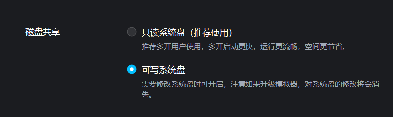
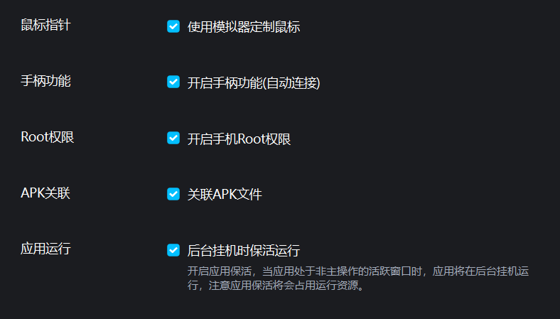
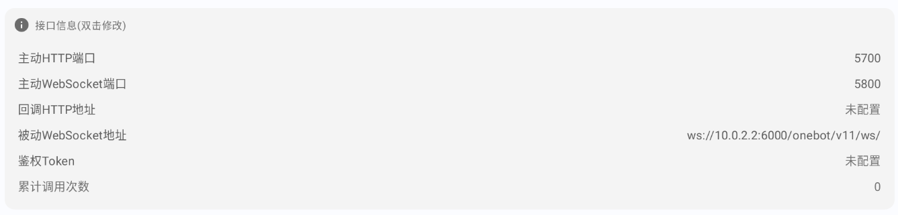
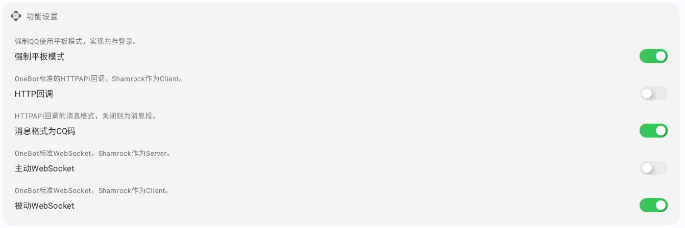

# GuGuBot2

## 主要功能


## 部署方法

### 配置Shamrock（类似go-cqhttp的作用）

> 考虑到 MuMu12 模拟器对 `Magisk` 和 `LSPosed` 暂时[还不支持](https://forum.libfekit.so/d/60-mumu12mo-ni-qi-an-zhuang-magiskhe-lsposed/3)，此处展示基于 `LSPatch` 的配置方案。
> 
> 其特点参看[OpenShamrock指南](https://whitechi73.github.io/OpenShamrock/guide/getting-started.html#%E6%97%A0-root-%E7%8E%AF%E5%A2%83)

1. 安装 MuMU12 模拟器，记得打开MuMU12模拟器的可写系统盘和 Root 权限。为了长期运行，建议打开后台保活。



2. 从[LSPatch](https://github.com/LSPosed/LSPatch)下载最新 `release` 的 `LSPatch` ，并安装到模拟器中。

3. 从[OpenShamrock](https://github.com/whitechi73/OpenShamrock)的 `Action` 下载最新开发版 `Shamrock` ，注意下载带有 `all` 字样的版本，如 `Shamrock-v1.0.7.r253.81be383-all.zip` ，并安装到模拟器中。

4. 参考[此页面](https://whitechi73.github.io/OpenShamrock/guide/faq.html#%E6%94%AF%E6%8C%81%E7%9A%84qq%E7%89%88%E6%9C%AC)给出的支持的 QQ 版本，选择最新即可，在[这里](https://qq.cn.uptodown.com/android/versions)选择对应的版本下载，在 MuMu 模拟器安装即可。

5. 在 `LSPatch` 中用 `Shamrock` 修补 QQ 。
     - 打开 `LSPatch` 并在管理页面选择 ` + ` 新建修补，可以选择从存储目录选择 QQAPK 或者直接使用已经安装过的 QQ 
     - 修补模式默认且应该优先选择本地模式，这样方便直接更新 `Shamrock` 模块而不用重新修补，缺点是需要 `LSPatch` 保持后台运行 
     - 其他配置保持默认，然后点击开始修补，修补完成后会提示安装(如果已经安装会提示卸载)，或者手动替换安装。
     - 安装 `Shamrock` 模块后在管理页面点击修补好的 QQ ，选择模块作用域勾选上 `Shamrock` 模块然后保存 
     - 启动 `Shamrock` 并重新启动 QQ 客户端 
     - 此时 `Shamrock` 会显示已激活。
     - 登录 `Bot` 账号，然后在 `Shamrock - 状态` 勾选 `强制平板模式` ，方便安卓手机登录监看。

### 安装GuGuBot2

1. `git clone` 本项目，进入项目根目录，创建虚拟环境并安装依赖
   ```shell
   python -m venv venv
   source venv/bin/activate
   pip install -r requirements.txt
   ```
2. 安装脚手架，参看[Nonebot2文档](https://nonebot.dev/docs/quick-start#%E5%AE%89%E8%A3%85%E8%84%9A%E6%89%8B%E6%9E%B6)

3. 安装 `NoneBot2`、`OneBot` 适配器和 `APScheduler` 插件
   ```shell
   pip install nonebot2[fastapi]
   nb adapter install nonebot-adapter-onebot
   nb plugin install nonebot-plugin-apscheduler
   ```
4. 运行 Bot 服务，但此时尚未配置模拟器和本机的通信，因此无法接收消息。
   ```shell
   nb run
   ```
   
### 配置Shamrock和GuGuBot2的通信

1. 启动 MuMu12 模拟器，查看 ADB 调试端口， 一般模拟器本体（即多开器内序号0）的端口为 `16384`，多开的模拟器会在此基础上加 `32`，参看 [MuMu模拟器说明文档](https://mumu.163.com/help/20230214/35047_1073151.html)。

2. 按照上述教程连接 adb，在 `CMD` 运行，配置端口转发。端口 `5700` 用于 `Shamrock` 的 `HTTP` 通信，口 `6000` 用于 `WebSocket` 通信。注意，此时不要运行 Bot 服务。
   ```shell
   adb.exe connect 127.0.0.1:16384
   adb forward tcp:5700 tcp:5700
   adb forward tcp:6000 tcp:6000
   ```
3. 配置 `被动WebSocket地址` 为 `ws://10.0.2.2:6000/onebot/v11/ws/`，其他端口默认，功能模式打开 `强制平板模式`、`消息格式为CQ码`、`被动WebSocket`、`HTTP`、`WebSocket`。可以参考下面配置。


4. 重启模拟器，然后依次启动 `LSPatch` 和 `Shamrock` ，然后启动 QQ 客户端。显示以下内容即为配置完成。

   ```log
   [INFO] uvicorn | asgi_send:287| ('127.0.0.1', 9999) - "WebSocket /onebot/v11/ws" [accepted]
   [INFO] nonebot | log:270| OneBot V11 | Bot 123456789 connected
   [INFO] websockets | handshake:642| connection open
   [DEBUG] on_bot_connect | _:10| 已连接到BOT
   ```
   
## 注意事项

1. 环境变量 `.env` 文件中的 `fastapi_reload` 需要为 `false`，群插件会加载两次，导致加群验证有概率会发送两遍报错
```log
ActionFailed(status='failed', retcode=35000, data={}, message='操作失败', echo='72')
```